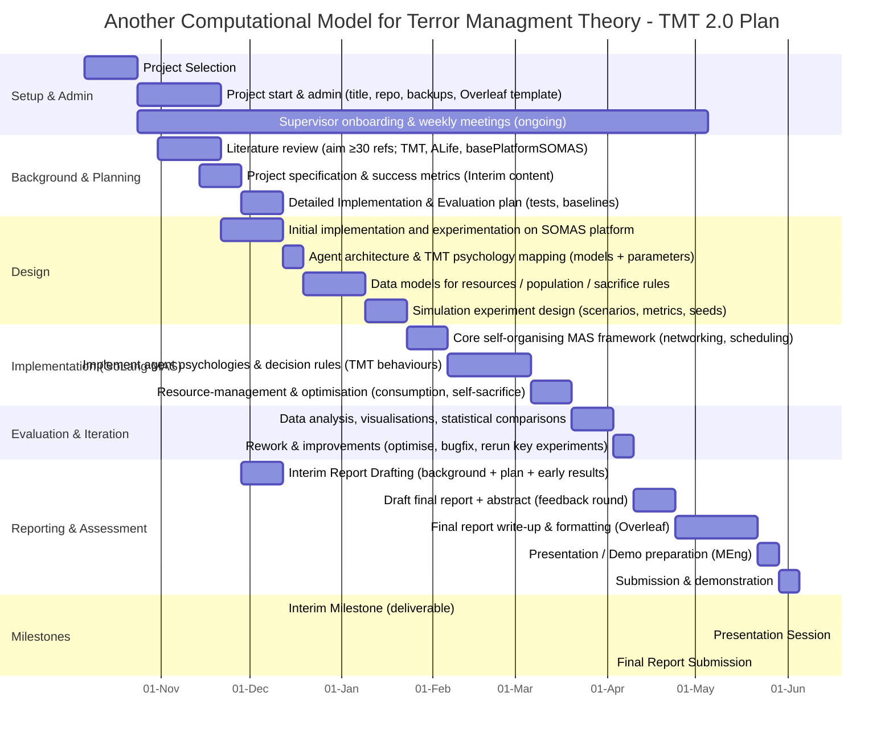

```mermaid
gantt
    title Another Computational Model for Terror Managment Theory - TMT 2.0 Plan
    dateFormat  DD-MM-YYYY
    axisFormat  %d-%b

    %% Project start (adjust start date if needed)
    section Setup & Admin
    Project Selection :select, 06-10-2025, 24-10-2025
    Project start & admin (title, repo, backups, Overleaf template) :setup, after select, 4w
    Supervisor onboarding & weekly meetings (ongoing) :meetings, after select, 05-05-2026

    section Background & Planning
    Literature review (aim ≥30 refs; TMT, ALife, basePlatformSOMAS) :lit, 31-10-2025, 3w
    Project specification & success metrics (Interim content) :spec, 14-11-2025, 2w
    Detailed Implementation & Evaluation plan (tests, baselines) :plan, after spec, 2w

    section Design
    Initial implementation and experimentation on SOMAS platform  :implement, after lit, 3w
    Agent architecture & TMT psychology mapping (models + parameters) :design, after implement, 1w
    Data models for resources / population / sacrifice rules :data, after design, 3w
    Simulation experiment design (scenarios, metrics, seeds) :simdesign, after data, 2w

    section Implementation (GoLang MAS)
    Core self-organising MAS framework (networking, scheduling) :core, after simdesign, 2w
    Implement agent psychologies & decision rules (TMT behaviours) :agents, after core, 4w
    Resource-management & optimisation (consumption, self-sacrifice) :optim, after agents, 2w

    section Evaluation & Iteration
    Data analysis, visualisations, statistical comparisons :analysis, after optim, 2w
    Rework & improvements (optimise, bugfix, rerun key experiments) :rework, after analysis, 1w

    section Reporting & Assessment
    Interim Report Drafting (background + plan + early results) :interimreport, 28-11-2025, 12-12-2025
    Draft final report + abstract (feedback round) :draft, after rework, 2w
    Final report write-up & formatting (Overleaf) :final, after draft, 4w
    Presentation / Demo preparation (MEng) :pres, after final, 1w
    Submission & demonstration :submit, after pres, 1w

    section Milestones
    Interim Milestone (deliverable) :milestone1, 12-12-2025, 12-12-2025
    Presentation Session :milestone3, after pres, 05-05-2026
    Final Report Submission :milestone2, after final, 11-05-2026
```
